# 👋 Hi, I'm Sunil Kumar

> Corporate Trainer • Cloud Consultant • Content Creator  
Bengaluru, India — I help teams and learners adopt cloud technologies (AWS, GCP, Azure) through hands-on training, talks, and practical content.

---

## Table of Contents
- [About](#about)
- [What I do](#what-i-do)
- [Speaking & Workshops](#speaking--workshops)
- [Selected Articles & Videos](#selected-articles--videos)
- [Certifications](#certifications)
- [Contact](#contact)

---

## About
I am a corporate trainer and cloud consultant with 17+ years of teaching and training experience across academia and industry. I focus on practical, hands-on upskilling in cloud technologies, infrastructure as code, and cloud-native tooling.

Key roles:
- Corporate trainer — delivering instructor-led and virtual sessions for enterprises and communities
- Consultant — advising on cloud adoption, architecture, and automation
- Content creator — blog posts, presentations, and video tutorials

---

## What I do
- Public workshops and corporate training on AWS, Terraform, and cloud best practices
- Technical talks and demos for developer communities and colleges
- Blog articles and video tutorials to help learners get practical cloud experience

---

## Speaking & Workshops (selected)
- **1. AWS Student Community Day — South TN, India** — 25 Oct 2025  
  Talk: "Simplifying database management with Amazon RDS and Aurora" ·
  [Event page](https://scd.awsugmdu.in/#speakers)
  [Slides](https://github.com/sunilkumarald/TechTalks2025/blob/October-2025/Amazon%20RDS%20and%20Aurora.pdf)

  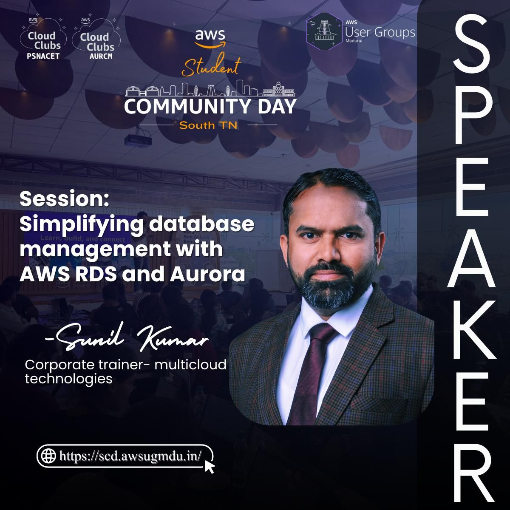
  
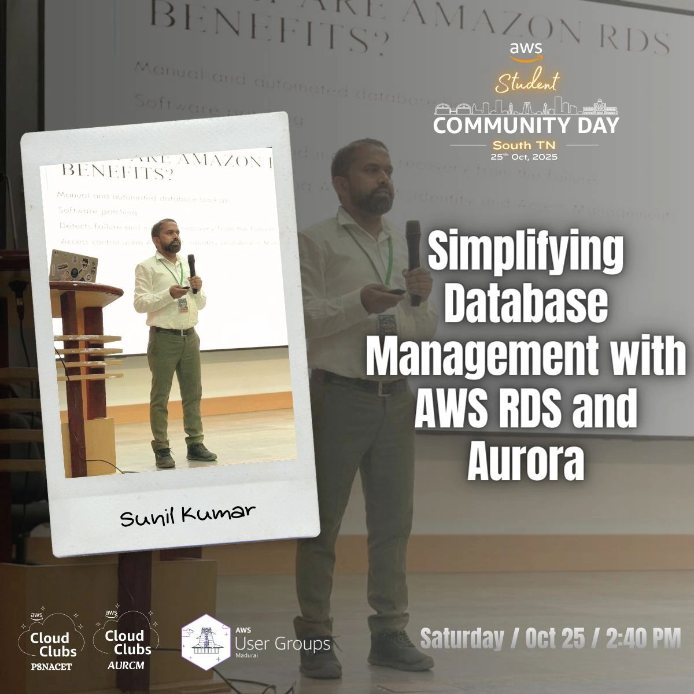

  - **2. HashiCorp User Group Bangalore Meetup #1** — 2 Nov 2025  
  Topic: "Deploying highly available web apps on AWS using Terraform" · [Slides](https://github.com/sunilkumarald/TechTalks2025/blob/October-2025/Deploying%20highly%20available%20web%20app%20on%20AWS%20with.pdf)

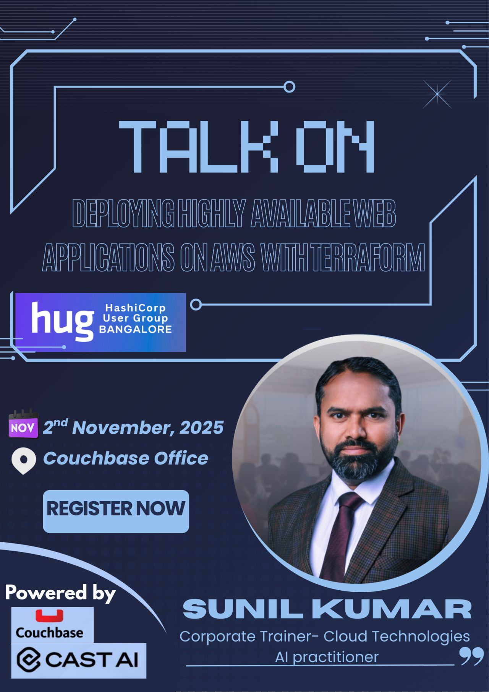

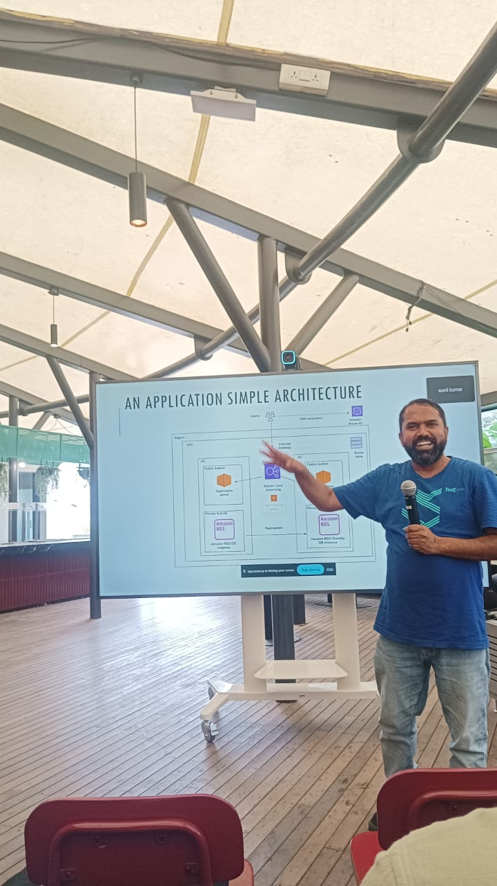

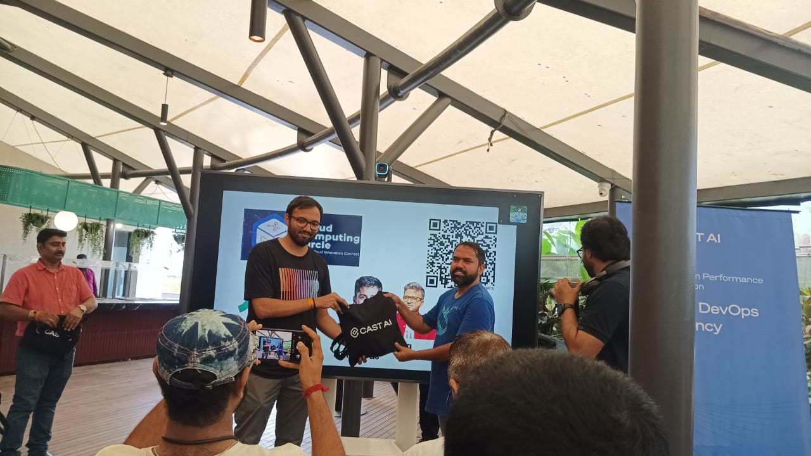

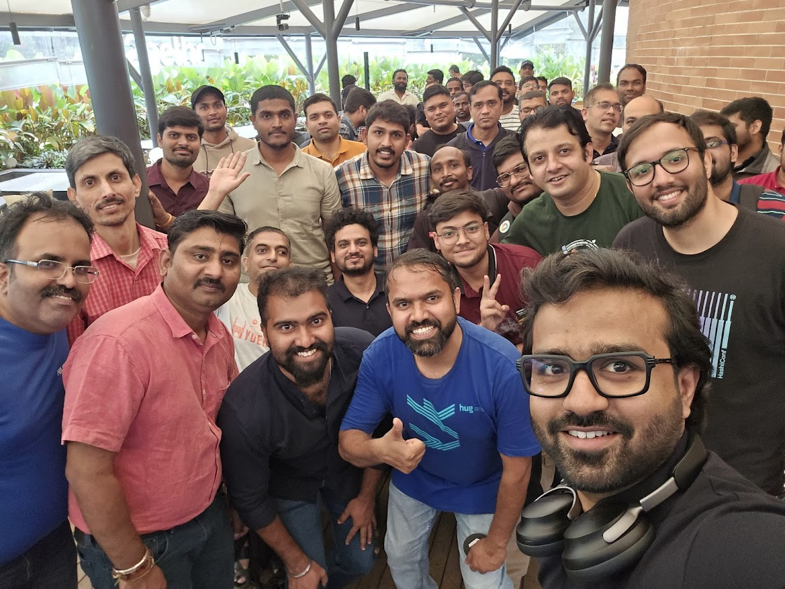

- **3. 12-Week AWS Workshop Challenge (AWS User Group Yaounde)** — 11 Oct 2025  
  Topic: "AWS Compute Services — EC2 mastery" · [Slides](https://github.com/sunilkumarald/TechTalks2025/blob/October-2025/Week2-%20AWS%20EC2%20and%20compute%20services-Mr%20Sunil%20Kumar.pdf) · [Recording](https://drive.google.com/file/d/1XMyIIcXvjL_HPaxbCIvq3p6U52sgdAuh/view?usp=sharing)

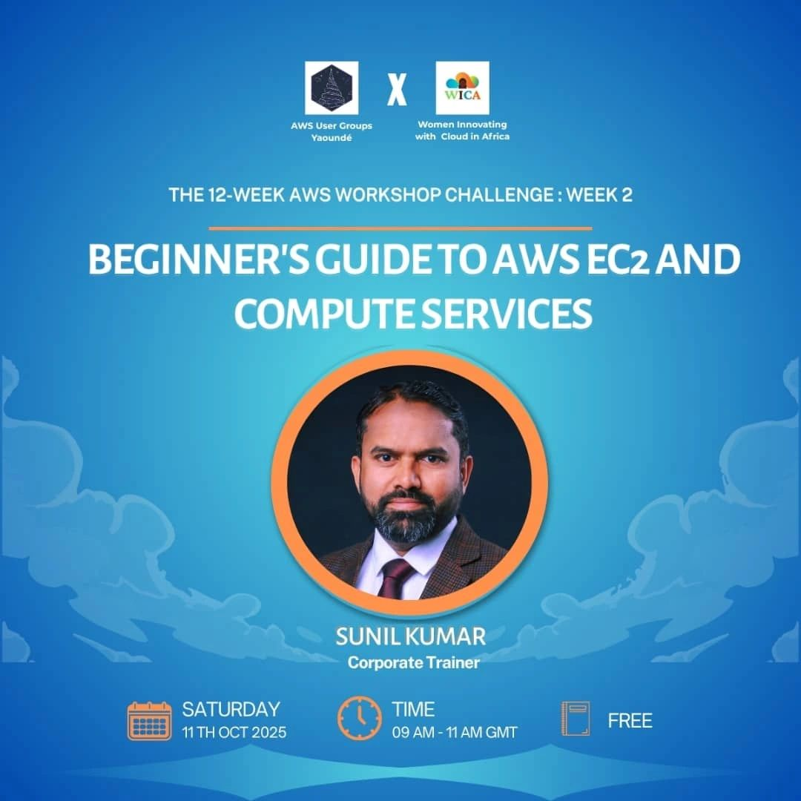
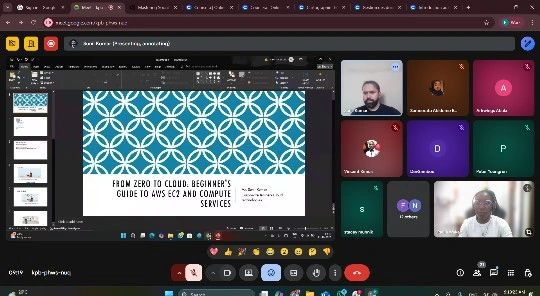

## 4. AWS Orientation
Date: 12 Aug 2025
Topic: AWS orientation session for B.Tech students

[LinkedIn post]:(https://www.linkedin.com/posts/cloudwithsunil_awstraining-cloudcomputing-upskilling-activity-7361634792834023425-jEBC)
[Slides]: (https://github.com/sunilkumarald/TechTalks2025/blob/August-2025/AWS%20Orientation.pdf)

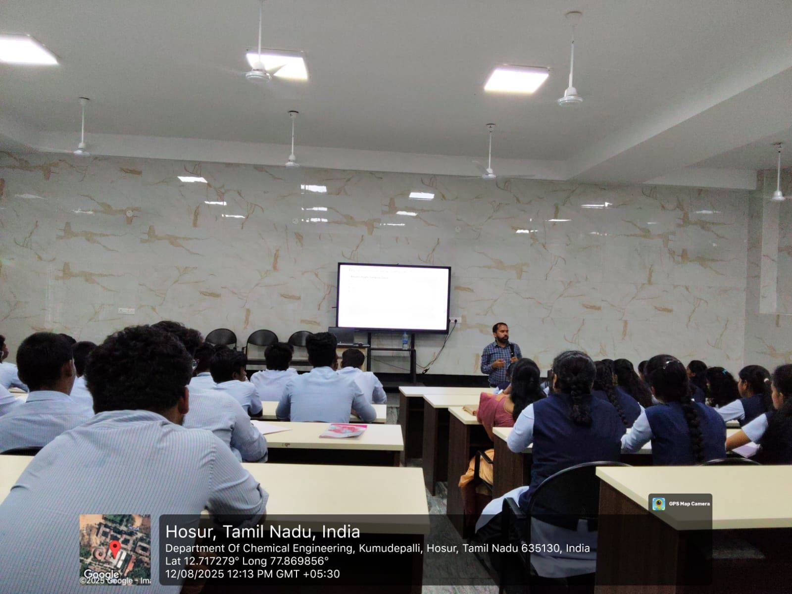
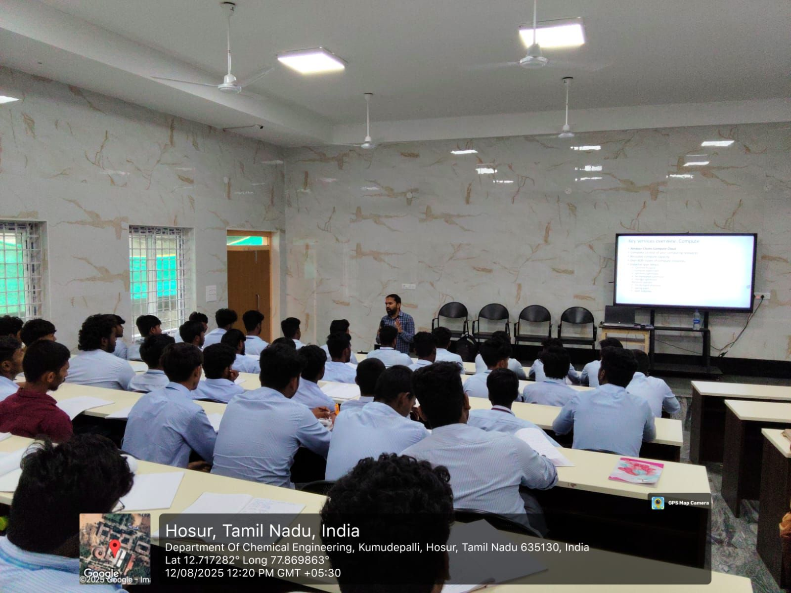

---

## 5. AWS Ignite
Date: 15 Feb 2025
Topic: AWS ML services — demos with Amazon Comprehend, Amazon Textract, Amazon Translate, Amazon Transcribe, Amazon Polly

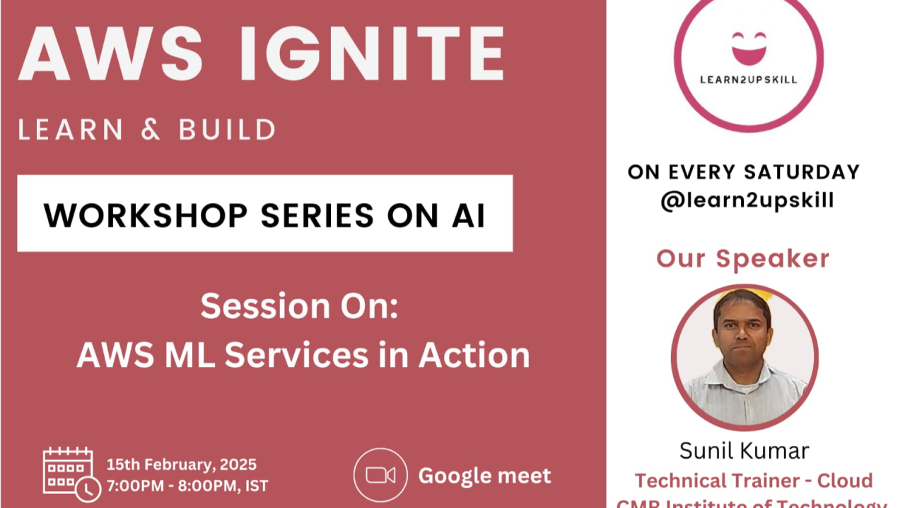

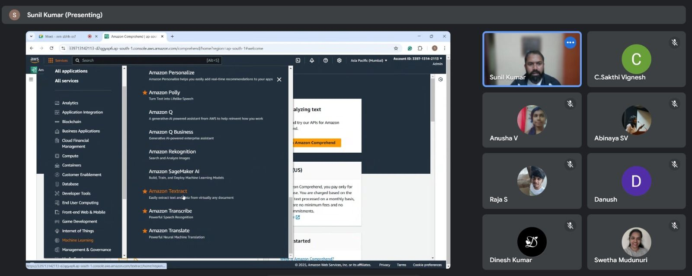

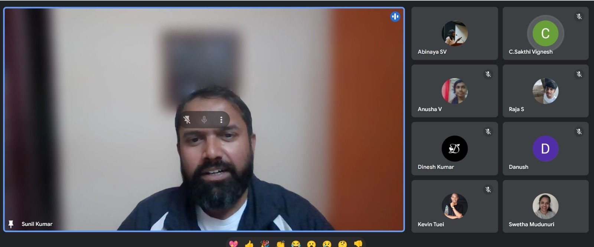

---

## 6. TechNexus Skill-up India Community event
Date: 19 Oct 2025
Topic: AI-900 exam preparation session

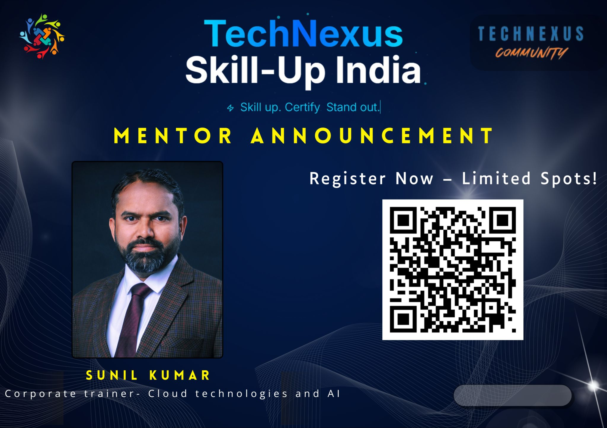

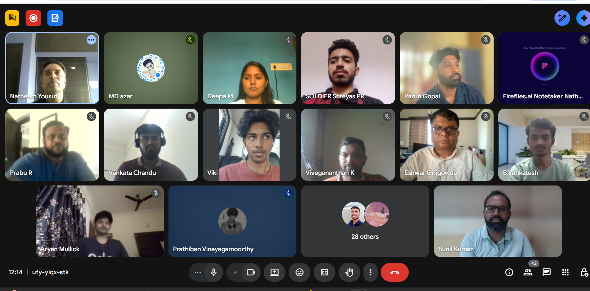

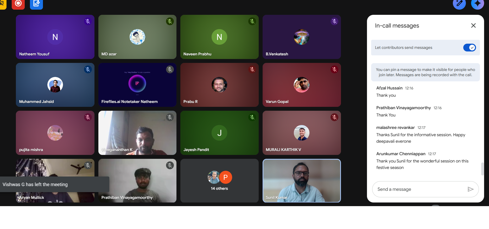

[For a full list of speaking/workshops and gallery of images, pl visit](https://github.com/sunilkumarald/sunilkumarald/blob/main/TALKS.md)

---

## Selected Articles & Videos
Featured posts:
- "1. Exploring AWS Gen AI Stack and Amazon Q Developer" — Medium · [Read](https://medium.com/@suniel.vns/my-enlightening-journey-through-week-6-of-the-aws-cohort-7-8bf36574c834)
- "2. Amazon Q CLI-Powered Game Development" — Medium · [Read](https://medium.com/@suniel.vns/amazon-q-cli-powered-game-development-9ec62fc6d67c)
- "3. How does AWS keep the meters running?" — Medium · [Read](https://medium.com/@suniel.vns/how-does-aws-keep-the-meters-running-2e36e5381d8c)

YouTube highlights:
- [AWS multi-session support](https://www.youtube.com/watch?v=_5qahn-PzAI)
- [Hands-on Amazon RDS for beginners](https://youtu.be/1n1KmfP7vIk?si=4_wTZk_4IHE_q01)

(See my full blog on Medium and the YouTube channel for more content.)

---

## Certifications
I am 7x cloud certified:
1. AWS Solutions Architect — Associate
2. AWS AI Practitioner
3. AWS Certified Cloud Practitioner
4. Google Cloud Associate Cloud Engineer
5. Microsoft Azure Data Fundamentals (DP-900)
6. Oracle Cloud Generative AI Professional
7. Oracle Cloud Generative AI Associate

Certifications in progress:
- AWS Developer — Associate
- AWS CloudOps — Associate
- Google Cloud Professional — Cloud Architect

[pl find the Credly credential page]:(https://www.credly.com/users/sunil-kumar.971a054e)

---

## Contact
- Email: suniel.vns@gmail.com
- LinkedIn: https://www.linkedin.com/in/cloudwithsunil/
- YouTube: https://www.youtube.com/@sunilkumarOnCloud
- Medium: https://medium.com/@suniel.vns

I'd love to connect about training, speaking, or collaboration opportunities.
