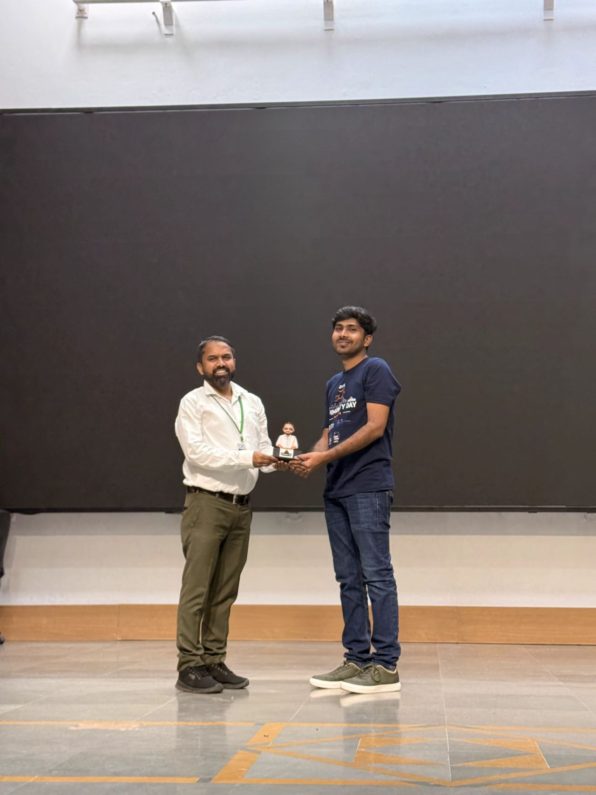
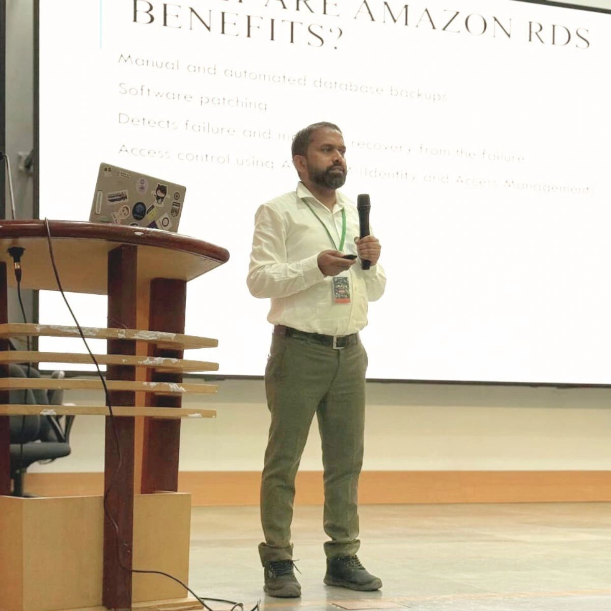
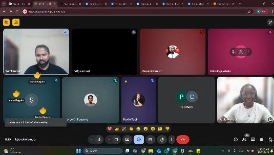
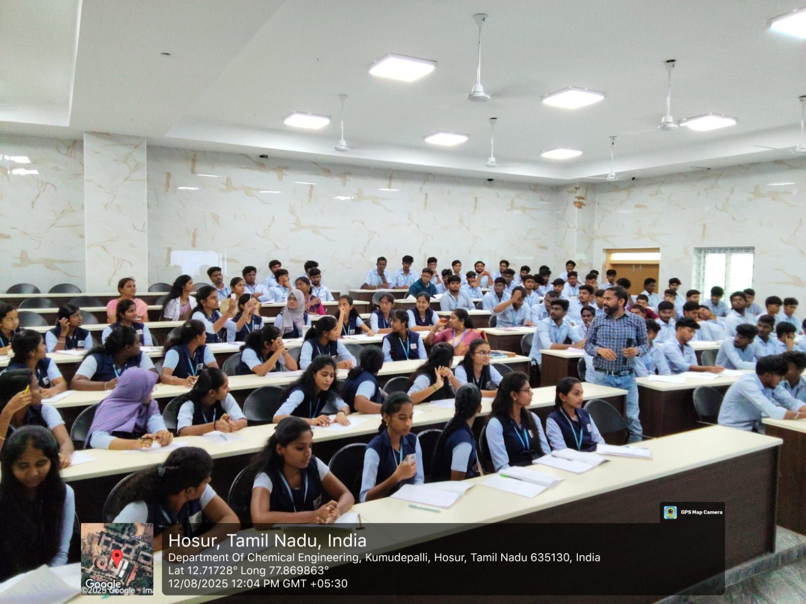
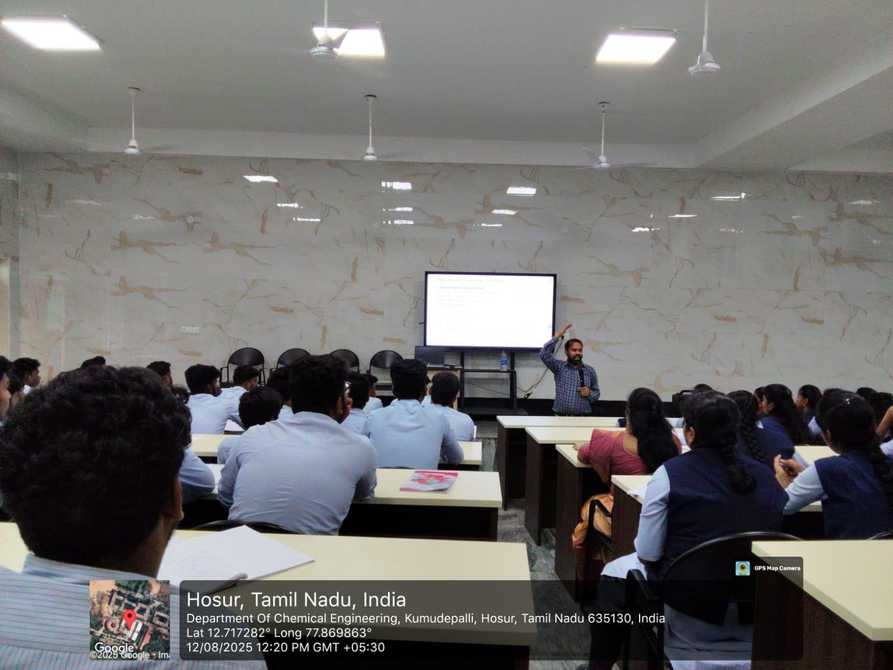
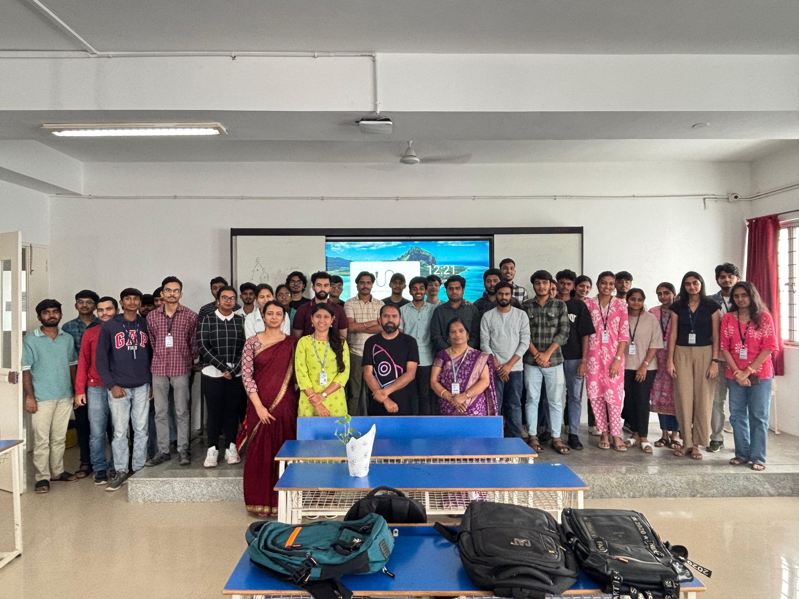
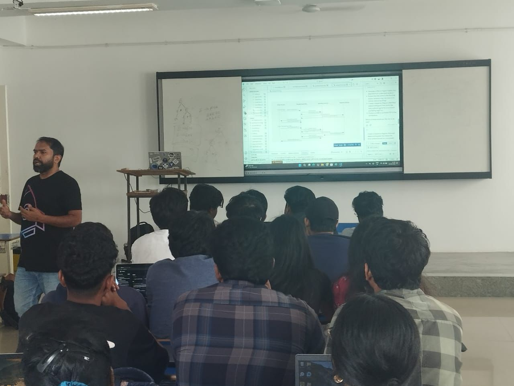
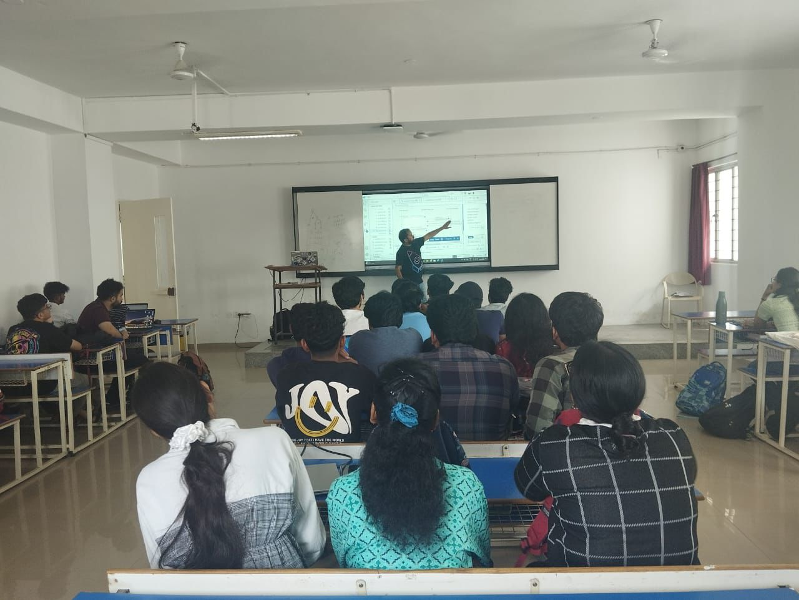
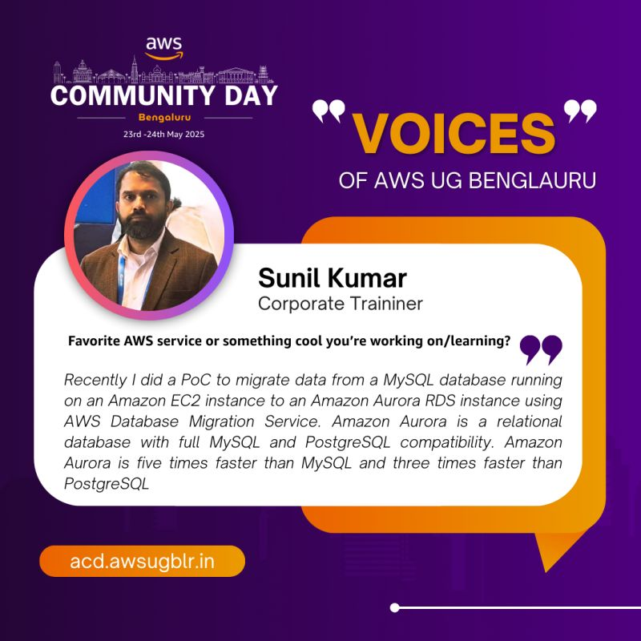

# Talks & Workshops — Gallery

This file contains a curated gallery of my recent public speaking events, slides, and recordings. Images referenced here are stored in the repository under `Images/publicspeaking/`.

## 1. Speaker at AWS Student Community Day - South TN, India
Date: 25 Oct 2025
Topic: Simplifying database management with Amazon RDS and Aurora

- Presentation Material: [Slides (pdf)](https://github.com/sunilkumarald/TechTalks2025/blob/October-2025/Deploying%20highly%20available%20web%20app%20%5B...%5D)
- Event page: https://scd.awsugmdu.in/#speakers

---

## 2. 12-Week AWS Workshop Challenge (AWS User Group Yaounde)
Date: 11 Oct 2025
Topic: AWS Compute Services — EC2 mastery

- Slides: [Week2 - AWS EC2 and compute services (pdf)](https://github.com/sunilkumarald/TechTalks2025/blob/October-2025/Week2-%20AWS%20EC2%20and%20compute%20services-Mr%20Sunil%20Kumar.p[...])
- Recording: https://drive.google.com/file/d/1XMyIIcXvjL_HPaxbCIvq3p6U52sgdAuh/view?usp=sharing

---

## 3. HashiCorp User Group Bangalore Meetup #1
Date: 2 Nov 2025
Topic: Deploying a highly available web application on AWS using Terraform

- Presentation Material: [Slides (pdf)](https://github.com/sunilkumarald/TechTalks2025/blob/October-2025/Deploying%20highly%20available%20web%20app%20%5B...%5D)

---

## 4. AWS Orientation
Date: 12 Aug 2025
Topic: AWS orientation session for B.Tech students

- LinkedIn post: https://www.linkedin.com/posts/cloudwithsunil_awstraining-cloudcomputing-upskilling-activity-7361634792834023425-jEBC
- Slides: https://github.com/sunilkumarald/TechTalks2025/blob/August-2025/AWS%20Orientation.pdf

---

## 5. AWS Ignite
Date: 15 Feb 2025
Topic: AWS ML services — demos with Comprehend, Textract, Translate, Transcribe, Polly

---

## 6. TechNexus Skill-up India
Date: 19 Oct 2025
Topic: AI-900 exam preparation session

---

## 7. College event — GitHub Copilot talk
Date: 15 Oct 2025
Topic: GitHub Copilot: AI-Driven Software Development

- LinkedIn post: https://www.linkedin.com/posts/cloudwithsunil_githubcopilot-aidrivensoftwaredevelopment-activity-7384797438152249344-TWpP

---

## Gallery — other images

(End of gallery)